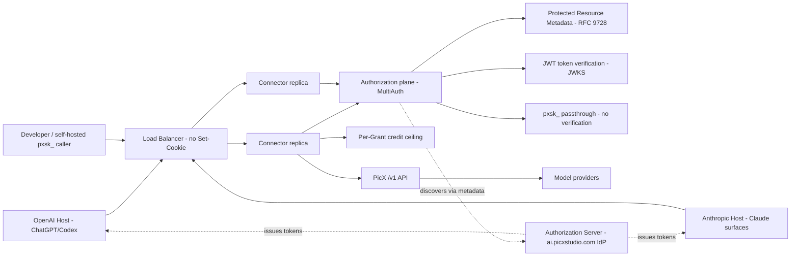

# Design Document: PicX Official Plugin Directory

## Overview

The PicX Official Plugin publishes the existing `picx-mcp` connector into two host directories — the OpenAI universal plugin directory (ChatGPT, Codex) and Anthropic's connector directory (claude.ai, Claude Desktop, Cowork, Claude mobile) — so that a user who has never heard of PicX can discover, install, authorize, and get a generated result without ever pasting an endpoint URL or an API key. Both hosts consume the same remote MCP server at `mcp.picxstudio.com`; this is one initiative, not two, because the publishable unit both hosts expect is identical: one connector plus one or more packaged skills.

The connector already exists and is conformant on the axes that matter most. `src/picx_mcp/server.py` mounts `stateless_http=True` because the load balancer does not forward `Set-Cookie`, so statelessness is a settled property, not a work item. Eighteen tools are registered and annotated. Per-request credential resolution lives in one place (`context.py`) and forwards the caller's own `pxsk_` key to `/v1` without storing it, so the service holds no credential it could leak. What does not exist is the authorization surface: `GET /.well-known/oauth-protected-resource` and `GET /.well-known/oauth-authorization-server` both return 404, there is no `skills/` directory, and there is no plugin manifest. This design's central problem is standing up MCP authorization (OAuth 2.1, RFC 9728 protected-resource metadata) over a stateless, multi-replica connector without breaking the API-key callers that work today, and packaging the connector with skills into a single bundle that both directories accept.

The design deliberately builds on the auth foundation already present. `auth.py` carries an `OAuthProxy` factory (Google-backed) and a token-to-session-key exchange stub; `settings.py` carries `google_client_id`, `google_client_secret`, `jwt_signing_key`, `storage_encryption_key`, `picx_mcp_base_url`, `redis_url`, `request_state_key` (documented as needing to be identical on every replica), and `session_credit_ceiling`. The installed `fastmcp==4.0.0b3` exposes `RemoteAuthProvider` (RFC 9728 metadata + 401 challenge), `JWTVerifier`, `MultiAuth`, `GoogleProvider`, and `require_scopes` — all verified present in the repo's `.venv` — which are the composition primitives this design assembles rather than inventing.

### Scope decisions and requirement resolutions

- **Statelessness is not restated as a goal.** The MCP spec version the hosts target (`2025-11-25`) makes `Mcp-Session-Id` optional, and neither host requires stateless operation. PicX is already stateless by deliberate choice, so Requirement 2 carries verification work, not implementation work. The one shared secret cross-replica continuity depends on — `request_state_key` for interactive-round state tokens — is treated as a deploy invariant, not a feature.
- **Authorization topology is resolved here with a recommendation, not left open.** Requirement's open decision 1 is answered in Architecture: designate the identity provider already behind `ai.picxstudio.com` as the authorization server and make the connector a pure resource server. Standing up a second AS is documented as the rejected alternative with its trade-offs.
- **OAuth coexists with `pxsk_` passthrough; neither breaks the other.** Credential resolution order in `context.py` is the coexistence mechanism: a `pxsk_` prefix is used verbatim; anything else is verified as an OAuth bearer and exchanged for a session key. Existing developer-mode and self-hosted callers are unaffected (Requirement 3.9).
- **Per-request token verification is stateless-compatible by construction.** Verification is a signature/JWKS check plus an issuer/audience/scope check, carrying no per-request server state, so every replica reaches the same decision for the same token. No replica-local session is consulted.
- **Scopes mirror the existing PicX API-key scope vocabulary.** No second permission model is defined (Requirement 4.1). The per-Grant credit ceiling is enforced against the existing `session_credit_ceiling`, keyed on a stable Grant identity derived from the token, before any spend.
- **The published tool surface is a recommended subset, not all 18.** Webhook and generation-history operations are developer-mode-only; the published surface is the set that maps to a recognizable end-user goal. The full 18 remain reachable in developer mode and for self-hosted API-key callers.
- **Host-imported skills are a static snapshot at scan time.** The release flow is designed around redeploy → rescan → resubmit for every skill change (Requirement 6.6), never runtime skill fetch.
- **Anthropic parity reuses the same OAuth build.** Claude connects from Anthropic cloud IP ranges, so any future IP allowlist must include those ranges. Whether OpenAI's `SKILL.md` is byte-compatible with Anthropic's skill format is an explicit confirmation step, not an assumption (Requirement 8.4).

## Architecture

The connector is a stateless MCP resource server behind a load balancer, fronting the PicX `/v1` API. It gains an authorization plane that advertises RFC 9728 protected-resource metadata, verifies bearer tokens per request, and composes with the existing API-key passthrough. The authorization server is external (the `ai.picxstudio.com` identity provider); the connector never issues tokens, only verifies them. The published bundle is a package-root artifact (`manifest`, `mcp.json`, `skills/`, `assets/`) that both host directories scan.



### Trust boundaries

1. **Host to connector (OAuth plane):** the host presents a bearer token minted by the designated authorization server. The connector verifies signature, issuer, audience (`resource`), expiry, and scope before any `/v1` call, credit deduction, or provider execution. No state from a prior request is trusted.
2. **Host to connector (API-key plane):** a `pxsk_` bearer is forwarded verbatim to `/v1`, which owns its own auth, scope, rate-limit, and credit-cap enforcement. The connector stores nothing and adds no second authorization decision on this plane beyond the credit ceiling.
3. **Connector to authorization server:** the connector consumes the AS's discovery and JWKS metadata only; it never holds the AS's signing key and never mints a token. Grant revocation is the AS's responsibility and takes effect through token expiry plus the token-to-session-key exchange failing closed.
4. **Connector to PicX `/v1`:** the caller's identity (API key, or session key resolved from a verified token) is forwarded; `/v1` remains the single owner of pricing, credit deduction, refund-on-failure, and request logging. The connector never calls a model provider directly and never reaches PicX session routes that bypass scope/credit enforcement — the client's base URL is pinned to `/v1` with no escape hatch.
5. **Package to host directory:** the bundle is a static snapshot the host scans at submission time. No host-specific declaration may add, replace, or disable a skill or the connector; host-specific data is presentation metadata only.

### Execution model

A tool call arrives with a bearer credential. The connector resolves it on one of two planes. On the OAuth plane, the token is verified (fail-closed on absent/expired/malformed/insufficient-scope, returning HTTP 401 with a `WWW-Authenticate` challenge naming the protected-resource metadata URL and required scope), the token's scopes are checked against the tool's required scope, and the token is exchanged server-side for a scoped PicX session key. On the API-key plane, a `pxsk_` is forwarded unchanged. Before any credit-spending tool executes, the per-Grant credit ceiling is checked against accumulated spend for that Grant; a call that would exceed it is refused with an explicit ceiling error before any deduction. The tool then calls `/v1`, which performs the authoritative price/deduct/execute/refund sequence, and the connector returns a result carrying the credit cost and stable identifiers but no secrets or internal identifiers. Verification and ceiling checks hold no per-request server state, so any replica reaches the same decision.

## Components and Interfaces

### Authorization plane (`src/picx_mcp/auth.py`, `context.py`)

- **Resource-server metadata:** a `RemoteAuthProvider` (verified present in `fastmcp==4.0.0b3`) advertising RFC 9728 protected-resource metadata at `/.well-known/oauth-protected-resource`, naming the canonical resource identifier and the designated authorization server issuer URL(s), and emitting the 401 `WWW-Authenticate` challenge. This replaces the two 404 responses that are the central gap today.
- **Token verifier:** a `JWTVerifier` configured with the authorization server's JWKS URI, expected issuer, and audience equal to the published `resource` value. Verification is per-request and stateless. If the designated AS exposes only OpenID configuration, discovery reads `/.well-known/openid-configuration`; if it exposes RFC 8414 metadata, discovery reads `/.well-known/oauth-authorization-server` (Requirement 3.3 accepts either).
- **Multi-plane composition:** `MultiAuth(server=<resource provider>, verifiers=[...])` accepts OAuth tokens through the resource provider while the `pxsk_` passthrough path remains a pre-check in `context.py`. Routes and OAuth metadata come from the resource provider; the API-key plane contributes no metadata and no OAuth surface.
- **Credential resolution order (`context.py`):** the coexistence rule, stated precisely — (1) read the bearer from the live request; (2) if it starts with `pxsk_`, use it verbatim as the PicX credential (passthrough, no verification, no round trip); (3) otherwise treat it as an OAuth access token, require the verified `AccessToken` from the auth provider, and exchange it for a scoped session key; (4) if neither yields a usable credential, reject with 401 before any `/v1` call. The `pxsk_` branch is checked first so existing callers incur no new verification and no behavior change. The connector never silently falls through to a service-wide key — that would spend one user's credits on another's call.
- **Token-to-session-key exchange:** `exchange_token_for_session_key(access_token)` resolves a verified token to a scoped, revocable PicX session key so the connector still never holds a real `pxsk_` on the OAuth plane. **Open dependency:** this requires a PicX API endpoint (`POST /api/internal/session-keys/resolve`, internal-only) that does not exist yet, and the session-key scope set omits `uploads:write`, which blocks OAuth-path uploads until a one-line backend fix lands. Both are recorded as open questions below, not designed around with an invented mechanism.

### Scope and spend control

- **Scope vocabulary:** the OAuth scopes are exactly the existing PicX API-key scopes (for example the generation, uploads, and read scopes the API already defines); no parallel permission model is introduced. A tool declares the scope it requires; `require_scopes` (verified present) enforces it, rejecting a call whose required scope is absent from the Grant before any deduction.
- **Credit ceiling:** enforced per Grant against `settings.session_credit_ceiling` (default 2000), independent of the account's daily cap. Accumulated spend is tracked per Grant in the shared Redis (`settings.redis_url`) so the ceiling holds across replicas and across concurrent calls on one Grant; when reached, spending tools are refused with an error stating the ceiling was reached. The existing `confirm_credit_threshold` (default 200) drives the interactive-confirmation round already implemented in `images.py`.
- **Safety hints and cost:** every credit-spending tool is annotated non-read-only (already true in `images.py`, `videos.py`); read tools carry `readOnlyHint=True`; `picx_delete_asset` carries `destructiveHint=True`. Spending tools return the credit cost in their result (`credits_used`) so the host can surface it.

### Published tool surface

The 18 registered tools split into a published surface (recognizable end-user goals) and a developer-mode-only remainder (platform maintenance). Recommended split:

- **Published:** `picx_generate_image`, `picx_edit_image`, `picx_generate_video`, `picx_get_generation`, `picx_search_templates`, `picx_get_template`, `picx_list_models`, `picx_get_account`, `picx_upload_asset`, `picx_list_assets`, `picx_delete_asset`.
- **Developer-mode-only (withheld from the published bundle):** `picx_get_webhook_deliveries`, `picx_redeliver_webhook`, `picx_get_generation_deliveries`, `picx_get_generation_events`, `picx_list_generations` (its list endpoint is 404 today and 404-guarded), `picx_get_tier`, `picx_get_usage`. These serve developer operations or diagnostics rather than an end-user creative goal.

The reasoning: a directory reviewer approves tools that map to a goal a user would state. Webhook delivery inspection, redelivery, and per-generation event/delivery streams are developer-operations capabilities; usage and tier reads are account-diagnostics. Retaining them in developer mode keeps them available for self-hosted API-key callers without asking a reviewer to reason about them. The server `instructions` value (already set in `server.py`) provides cross-tool guidance in its first 512 characters and must not restate every tool description.

### Packaging and skills

- **Package root:** a root manifest declaring portable package identity (name, version, description); `mcp.json` declaring the connector with the MCP Streamable HTTP transport and the stable URL `https://mcp.picxstudio.com`; a `skills/` directory; an `assets/` directory holding visual assets referenced by package-root-relative paths. Because the plugin has no user interface, screenshots are omitted.
- **Host-specific presentation metadata:** display name, short/long descriptions, developer name, category, capabilities, website URL, privacy policy URL, terms of service URL, starter prompts, brand colour, composer icon, logo — presentation only, never able to add/replace/disable a skill or the connector.
- **Skills (`skills/<name>/SKILL.md` + optional `references/`, `scripts/`, `assets/`):** at minimum a video-mode-selection skill stating the required fields for each of the seven modes and that `lipsync` needs no prompt while every other mode requires a non-empty prompt (matches `videos.py`), and a template-first-generation skill stating the three catalogue behaviours — `total` is an estimate (page until a short page returns), the topic filter works while the topic field is always null, and a null prompt is a gated row not missing data (matches `templates.py`). Each skill's frontmatter states name and description; the body states expected input, steps, output, facts the model must not infer, and when to ask/stop/decline. A skill that depends on the connector declares that dependency with the Streamable HTTP transport and the connector URL.
- **Static-snapshot release flow:** host-imported skills are frozen at scan time. Any skill or manifest change follows redeploy connector → rescan → resubmit before it reaches users. A tool schema/description/annotation or `instructions` change is deployed and allowed to pass the host's required checks before being relied upon. The connector URL is kept stable; changing it is a new submission, not a deployment change.

### Representative service contracts

```python
# context.py — credential resolution order (the coexistence rule)
def resolve_api_key() -> str:
    raw = _bearer_from_headers()
    if raw and raw.startswith("pxsk_"):
        return raw                          # Plane 1: passthrough, no verification
    token = _verified_oauth_access_token()  # Plane 2: fail-closed if unverified
    if token:
        return exchange_token_for_session_key(token)  # scoped, revocable session key
    raise PicXError("no credential", status_code=401)  # before any /v1 call
```

```python
# auth.py — resource server + multi-plane composition (fastmcp==4.0.0b3, verified)
def build_auth() -> "AuthProvider | None":
    s = get_settings()
    if not s.oauth_configured:
        return None                         # Plane 1 only: no OAuth surface advertised
    verifier = JWTVerifier(jwks_uri=<AS_JWKS>, issuer=<AS_ISSUER>,
                           audience=s.picx_mcp_base_url)  # audience == published resource
    resource = RemoteAuthProvider(
        token_verifier=verifier,
        authorization_servers=[<AS_ISSUER_URL>],
        base_url=s.picx_mcp_base_url,
        scopes_supported=<PICX_API_KEY_SCOPES>,   # mirrors existing scope vocabulary
    )
    return MultiAuth(server=resource)       # pxsk_ plane handled in context.py pre-check
```

Tool results return discriminated, safe payloads: a stable identifier for later reference, `credits_used` on spending tools, and a resource link for media (never base64). Errors carry a status the caller can map faithfully and never leak a credential, session/trace/request identifier, internal account identifier, or internal log.

## Data Models

Records are scoped to the calling identity. No durable per-session server state is introduced beyond the per-Grant spend counter and the interactive-round state token, both keyed in shared Redis so replicas agree.

- **Grant:** a stable identity derived from a verified token (issuer + subject + audience), the scope set carried by the token, and its expiry. The unit against which the credit ceiling is enforced. Never surfaced in a tool result.
- **AccessToken (verified):** issuer, subject, audience (`resource`), scopes, expiry — produced by the token verifier, consumed by scope checks and the exchange. Raw token never logged or echoed.
- **SessionKey (resolved):** a scoped, revocable PicX session key exchanged from a verified token; forwarded to `/v1`; never a real `pxsk_`; never returned in a result.
- **ProtectedResourceMetadata (RFC 9728):** canonical resource identifier, one or more authorization server issuer URLs, supported scopes, resource documentation URL — served at `/.well-known/oauth-protected-resource`.
- **GrantSpend:** Grant identity, accumulated credits spent, ceiling value; incremented on each spending tool result; the concurrency-safe check point for the ceiling.
- **PluginManifest / McpJson:** package name, version, description; connector transport (Streamable HTTP) and stable URL; skill discovery root.
- **HostPresentation:** display name, descriptions, developer name, category, capabilities, website/privacy/terms URLs, starter prompts, brand colour, icon, logo; package-root-relative asset paths; no screenshots (no UI).
- **Skill:** directory name, `SKILL.md` name + description, body (input, steps, output, must-not-infer facts, ask/stop/decline conditions), optional `references/`/`scripts/`/`assets/`, connector dependency declaration.
- **ToolDescriptor (per exposed tool):** action-oriented name, human-readable title, when-to-use description, input schema, output schema where structured, safety annotations, required scope, credit-spending flag.

## Correctness Properties

*A property is a characteristic or behavior that should hold true across all valid executions of a system — a formal statement of what the system should do. Properties bridge the requirements and executable tests.*

### Property 1: Token verification is fail-closed before any spend

For any request on the OAuth plane and any credit-spending tool, an absent, expired, malformed, or wrong-audience token, or a token failing signature verification, produces a rejection before any `/v1` call, any credit deduction, and any provider execution; a spending call proceeds only after a token verifies against the designated authorization server's keys, issuer, and audience.

**Validates: Requirements 3.6, 3.7**

### Property 2: Scope absence prevents side effects

For any verified Grant and any tool declaring a required scope, a tool call whose required scope is absent from the Grant is rejected before any credit deduction or provider call; a call proceeds only when the Grant carries the required scope, and the scope vocabulary checked is exactly the existing PicX API-key scope set with no parallel permission model consulted.

**Validates: Requirements 4.1, 4.2**

### Property 3: Credential-plane coexistence preserves existing callers

For any bearer credential, a value with the `pxsk_` prefix is forwarded verbatim to `/v1` with no OAuth verification and no behavior change from the pre-OAuth build, while any other value is treated as an OAuth token requiring verification and exchange; introducing the OAuth plane changes the outcome of no request that a pre-OAuth `pxsk_` caller would have made.

**Validates: Requirements 3.9**

### Property 4: Stateless replicas reach identical authorization decisions

For any single token presented to any replica, the accept/reject decision, the resolved scope set, and the challenge emitted on rejection are identical across replicas, because verification consults only the token, the authorization server's published keys/metadata, and configuration required to be identical on every replica; no replica-local session or prior-request state alters the decision.

**Validates: Requirements 2.3, 2.6, 3.6**

### Property 5: Protected-resource discovery and challenge are well-formed

For any unauthenticated request the connector rejects, it returns HTTP 401 with a `WWW-Authenticate` challenge naming the protected-resource metadata URL and the required scope; `GET /.well-known/oauth-protected-resource` returns metadata carrying the canonical resource identifier and at least one authorization server issuer URL; and the `resource` value the connector accepts and echoes equals the value published in that metadata.

**Validates: Requirements 3.1, 3.2, 3.5**

### Property 6: A rejected request never spends credits or calls a provider

For any request rejected for missing/invalid token, insufficient scope, or a reached credit ceiling, no credit is deducted, no PicX `/v1` generation route is called, and no model provider is invoked; the rejection is observable as an error before the first side-effecting call.

**Validates: Requirements 3.7, 4.2, 4.3**

### Property 7: The credit ceiling is never exceeded across concurrent calls on one Grant

For any Grant, any ceiling value, and any interleaving of concurrent spending calls, the sum of credits admitted for spending never exceeds the ceiling; once accumulated spend reaches the ceiling, every further spending call is refused with an error stating the ceiling was reached, and the refusal precedes any deduction.

**Validates: Requirements 4.3**

### Property 8: Tool results never contain secrets or internal identifiers

For any tool result on any plane, the payload contains no auth secret, token, key, or password, and no internal or diagnostic identifier — no session, trace, or request identifier, no internal account identifier, and no internal log — while still returning a stable public identifier sufficient for a later tool call to refer to the same record.

**Validates: Requirements 5.4, 5.5, 5.8**

### Property 9: Spending tools report cost and truthful safety hints

For any exposed tool, a credit-spending tool is annotated non-read-only and returns its credit cost in the result, a read-only tool is annotated read-only and spends nothing, and a destructive tool is annotated destructive; the annotation matches the tool's actual effect in every case.

**Validates: Requirements 4.4, 4.5, 5.3**

### Property 10: The published surface excludes developer-operations tools

For the published Plugin, every exposed tool maps to a recognizable end-user goal and no developer-operations tool (webhook delivery inspection/redelivery, per-generation event/delivery streams, generation-history list, usage/tier diagnostics) is present; each exposed tool declares an action-oriented name, a human-readable title, a when-to-use description, an input schema, and an output schema where it returns structured data.

**Validates: Requirements 5.1, 5.2, 5.3**

### Property 11: Skills state the facts that prevent validation errors

For the video-mode-selection skill, the required fields of all seven modes are stated and `lipsync` is the only mode declared to allow an empty prompt; for the template-first skill, `total` is stated to be an estimate that requires paging until a short page, the topic field is stated to be always null while the topic filter works, and a null prompt is stated to indicate a gated row rather than missing data — matching the connector's actual behavior in `videos.py` and `templates.py`.

**Validates: Requirements 6.2, 6.3, 6.4**

### Property 12: The package is host-neutral and self-contained

For the published bundle, skills are discovered under `skills/` and the connector under `mcp.json` at the package root, and no host-specific declaration adds, replaces, or disables either; every host-specific asset path is expressed relative to the package root; and because the plugin has no UI, screenshots are absent.

**Validates: Requirements 1.1, 1.2, 1.4, 1.5**

### Property 13: Anthropic reachability and auth reuse hold

For a request originating from Anthropic's published cloud IP ranges, the connector is reachable and satisfies Anthropic connector authorization through the same OAuth implementation built for Requirement 3, requiring no PicX-specific credential-paste flow; if the connector is ever placed behind an IP allowlist, Anthropic's published ranges are included, so a Claude user is never rejected while a developer machine still reaches it.

**Validates: Requirements 8.1, 8.2, 8.3**

## Error Handling

Rejections use stable, safe categories mapped from the connector's `PicXError` status: `unauthenticated` (no credential, 401 with `WWW-Authenticate` challenge), `token_invalid` (malformed/expired/wrong-audience/bad-signature), `insufficient_scope` (403-style, required scope absent from Grant), `credit_ceiling_reached` (Grant ceiling hit), `oauth_not_enabled` (OAuth plane not configured on this deployment — 501, the current stub behavior), `invalid_input`, `insufficient_credits` (402 from `/v1`), `rate_limited` (429 from `/v1`), `not_found`, `provider_unavailable`, and `internal`. Security-sensitive failures fail closed: a missing or invalid token, an absent scope, a reached ceiling, and an unresolvable token-to-session-key exchange all block the `/v1` call and any spend before it happens. No error message leaks a credential (`client.redact()` is used), a session/trace/request identifier, an internal account identifier, or an internal log. Provider and `/v1` failures are surfaced with their faithful status and safe detail; `/v1` remains the owner of refund-on-failure, so a provider failure after deduction is refunded upstream, not reconciled in the connector.

## Testing Strategy

Property-based testing applies to the pure/decision portions: credential-plane resolution, token verification decisions (as a pure function of token + published keys/metadata), scope checks, the per-Grant ceiling accountant, result-sanitization (secret/internal-identifier redaction), annotation-versus-effect consistency, and package/skill structural validation. It does not apply to real authorization-server behavior, live `/v1` calls, host directory scanning, or provider execution — those are mocked or fixture-driven.

- Use the repository's Python test runner (`pytest`, present under `tests/`). Each property test runs at least 100 cases and includes a comment in the exact form `Feature: official-plugin-directory, Property N: <property text>`.
- Implement one property-based test per numbered property, with fakes for the authorization server (JWKS + issued tokens), the token-to-session-key exchange, `/v1`, Redis (for the ceiling accountant), and the clock (for expiry).
- Use table-driven unit tests for credential-prefix branching, error-category mapping, safety-annotation-versus-effect for all 18 tools, and the published-versus-developer-mode split.
- Use integration tests for the RFC 9728 metadata endpoint, the 401 `WWW-Authenticate` challenge, `MultiAuth` composition accepting both planes, and stateless cross-replica agreement (same token to two server instances yields the same decision).
- Do not property-test the live authorization server, the live `/v1` API, host directory submission, or provider services. Confirm Anthropic reachability and submission-path parity through the explicit verification steps below rather than automated tests.

### Open questions (undetermined from source or requirements)

These are recorded as open rather than resolved with an invented mechanism:

- **Token-to-session-key exchange endpoint does not exist.** `POST /api/internal/session-keys/resolve` (internal-only, mTLS or shared secret) is the contract in `auth.py`'s stub but is Phase 5 backend work on the PicX API. Until it ships, the OAuth plane cannot resolve a session key and `context.py` correctly fails closed (501). The exchange's caching/TTL policy is also unspecified.
- **`uploads:write` scope is missing from the session-key scope set.** With OAuth resolving to a session key, uploads (and therefore every edit flow, since `/v1/images/edit` rejects data URIs) will 403 until the backend adds `uploads:write` to the session-key scope set. This is a one-line backend fix but is a hard blocker for the OAuth-path edit/upload surface.
- **The exact PicX API-key scope names are not enumerated in `picx-mcp`.** The design requires the OAuth scopes to equal the existing vocabulary; the authoritative list lives in the PicX API (`SESSION_KEY_SCOPES` and the API-key scope definitions), not in this repo. The concrete scope strings must be read from there before the verifier's `scopes_supported` is finalized.
- **Which `ai.picxstudio.com` IdP discovery form is served.** Requirement 3.3 accepts either `/.well-known/oauth-authorization-server` (RFC 8414) or `/.well-known/openid-configuration`. Which one the designated AS actually serves, and whether it supports the Host client identification methods (CIMD, Dynamic Client Registration, or a predefined client) plus PKCE, must be confirmed against the live IdP before the `JWTVerifier`/`RemoteAuthProvider` issuer wiring is fixed.
- **Anthropic submission and skill-format parity are unverified.** Whether a single bundle's `SKILL.md` is accepted unmodified by both directories, and Anthropic's directory submission mechanics, are confirmation steps (Requirement 8.4), not assumptions.
- **Per-Grant spend persistence across token rotation.** The ceiling is per Grant; how a Grant identity survives token refresh (subject-stable versus token-stable) determines whether accumulated spend resets on refresh. The subject-stable interpretation is assumed but must be confirmed against the AS's refresh semantics.

### Research findings informing the design

- The [MCP authorization specification](https://modelcontextprotocol.io/specification/2025-06-18/basic/authorization) defines the resource-server role, protected-resource metadata, and the `WWW-Authenticate` challenge this design implements via `RemoteAuthProvider`.
- [RFC 9728 (OAuth 2.0 Protected Resource Metadata)](https://datatracker.ietf.org/doc/html/rfc9728) and [RFC 8414 (Authorization Server Metadata)](https://datatracker.ietf.org/doc/html/rfc8414) define the `.well-known` documents the connector and the designated authorization server must publish.
- The installed `fastmcp==4.0.0b3` package (verified in the repo `.venv`) provides `RemoteAuthProvider`, `JWTVerifier`, `MultiAuth`, `GoogleProvider`, `require_scopes`, and `RequestStateSecurity`; the composition in this design uses only these existing capabilities.
- [Anthropic's connector documentation](https://docs.anthropic.com/en/docs/agents-and-tools/mcp) and the requirement's verified note that Claude connects from Anthropic cloud IP ranges inform the reachability and IP-allowlist properties.
