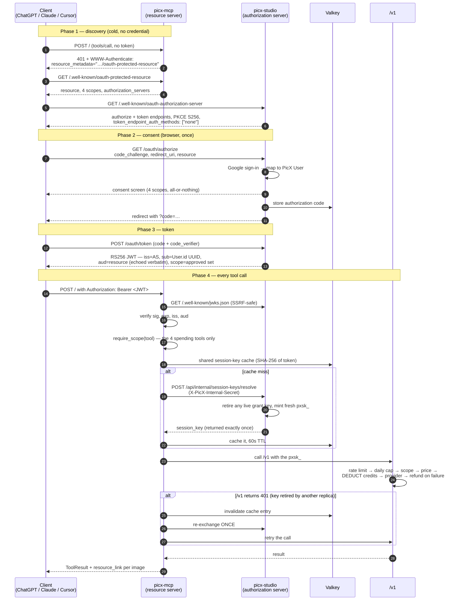

# PicX MCP — authentication flow

The connector's auth path spans two services, and almost every bug it has had
came from misreading which service owns what. This is the map.

- **picx-studio** (`api.picxstudio.com`) is the **authorization server**. It owns
  Google sign-in, the consent screen, the signing key, and the grant-key mint.
- **picx-mcp** (`mcp.picxstudio.com`) is a **pure resource server**. It verifies
  tokens and issues nothing. It holds no signing key and no lasting user
  credential, so compromising it yields a token verifier, not a token factory.

## The flow

## Why each guard exists

| Guard | Without it |
|---|---|
| 401 + `WWW-Authenticate` | A 200 with the error in the body never starts an OAuth flow — the host shows "go get an API key" instead of a sign-in. |
| `aud` accepted in **both** slash spellings | The published `resource` carries a trailing slash (pydantic `AnyHttpUrl`) and the client echoes it verbatim, so a bare-string compare 401s every call after a successful login. |
| `sub` matched against `User.id` | The token's `sub` is the user's UUID, not `oauth_sub` (which holds `google@…`). Matching the wrong column fails every grant. |
| Full four-scope default | The scopes are one capability set; a partial grant 403s tools the user was never offered a choice about. |
| `securitySchemes` + `_meta["mcp/www_authenticate"]` | ChatGPT shows no linking UI without **both**, so a stale grant becomes a permanent dead end. |
| **Shared** session-key cache | The mint retires the previous key, so a per-process cache on 2 replicas replays a key another replica already killed. |
| One-shot re-exchange on 401 | Covers two replicas missing the cache simultaneously; bounded to one attempt because each exchange retires another key. |
| `/v1` owns pricing | Reimplementing credit logic here would eventually diverge, and a divergence in money logic is a silent billing bug. |

## Known gaps

- **Credit ceiling is per-process.** Across 2 replicas the effective limit is
  ~2× `session_credit_ceiling`. A weaker guard, not a failure — same root cause
  as the session-key cache, and the same shared-store fix applies.
- **The `pxsk_` API-key plane does not work on an OAuth deployment.** The JWT
  verifier rejects a `pxsk_` before any tool runs, so the plane functions only
  where `picx_auth_issuer` is unset. Verified against production and reproduced
  locally under both configurations. The docs currently advertise it as an
  alternative to OAuth; either restore it with a composite verifier or drop the
  claim.

## The pattern worth remembering

Four of the six bugs fixed on 2026-09-20/21 were one mistake wearing different
clothes: **state that belongs to a user, stored in memory that belongs to a
process**, on a deployment that runs two of them — OAuth codes behind a full
`noeviction` Valkey, the task backend, the session-key cache, and the credit
ledger (still open).

And five of the six were invisible from outside, because each layer returned a
plausible success to the layer above. Sign-in completed every time. That is why
"it looks like it works" was never evidence, and why the tests added alongside
each fix assert on wire bytes rather than on Python objects.
